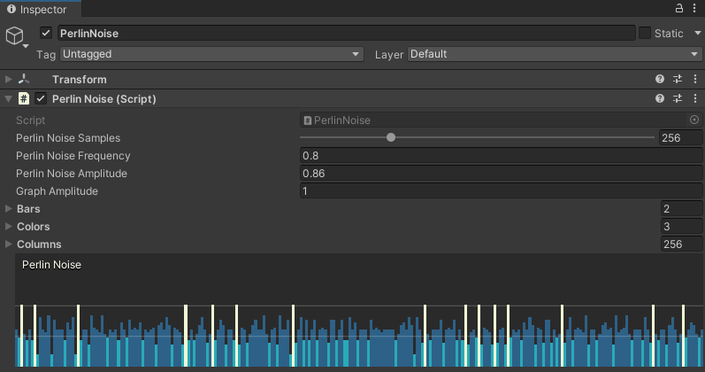

# GUI Graph Drawer
  
It's an experimental project about drawing GPU accelerated graphs on gui (inspector and builds).

## Installation

*Requires Unity 2019+*

### Install via UPM (using Git URL)
```json
"com.gustavopsantos.guigraphdrawer": "https://github.com/gustavopsantos/guigraphdrawer.git?path=/Assets/GUIGraphDrawer/#1.0.0"
```
